# Anti Nuke
RexZ provides a powerful and reliable Anti-Nuke system to ensure the safety and security of your Discord server. This feature is designed to prevent malicious activities and unauthorized changes that could harm your community.

# What is Anti-Nuke?
Anti-Nuke refers to a set of protective measures designed to safeguard a Discord server against malicious actions such as mass bans, channel deletions, or unauthorized role modifications, commonly known as "nuking."

## Why Choose RexZ for Anti-Nuke?
- **Real-Time Monitoring:** RexZ continuously monitors server activity and instantly responds to threats.
- **Customizable Settings:** Tailor the Anti-Nuke system to your server's unique needs.
- **User-Friendly Commands:** Effortlessly manage the Anti-Nuke feature using simple and intuitive commands.

---

## Anti ban

### What is AntiBan?
Sets limit on how many bans bot will get triggered and take action on the user who used ban.
For example on [**-antiban 1**] bot will get triggered on 1 ban by anyone and bot will take action against that user.

{.compact}
Aliases   | Usage
---       | ---
antib     | antiban <1/2/3/4/...>

### Example
--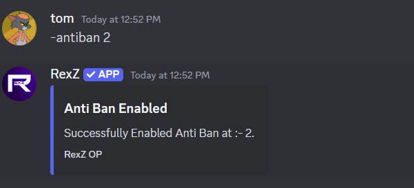--
--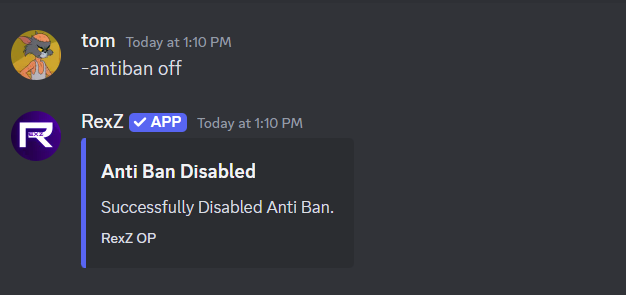--

---

## Anti bot

### What is AntiBot?
Enabling antibot will restricts user from adding bots in guild.

### Example
--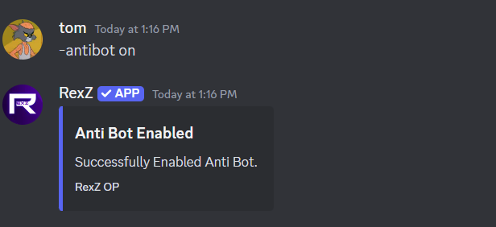--
----

---

## Anti channel create

### What is AntiChannelCreate?
Set guild's channel create limit. For example [**-antichannelc 2**] bot will be triggered when the user tries to create second channel in guild.

### Example
--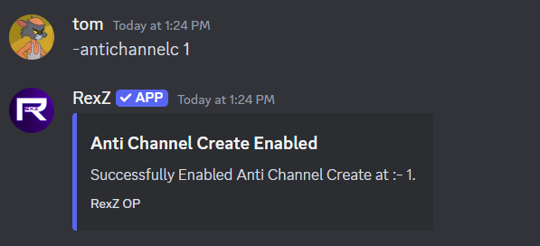--
----

---

## Anti channel delete

### What is AntiChannelDelete?
Set guild's channel delete limit. For example [**-antichanneld 3**] bot will be triggered when the user tries to delete third channel in guild.

### Example
--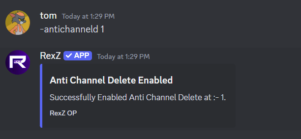--
--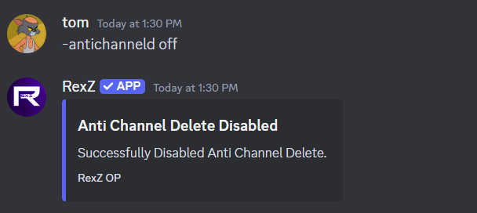--

---

## Anti channel update

### What is AntiChannelUpdate?
Enabling anti channel update will restrict users to update any channel in guild.

### Example
--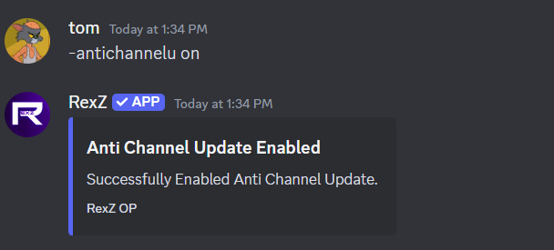--
--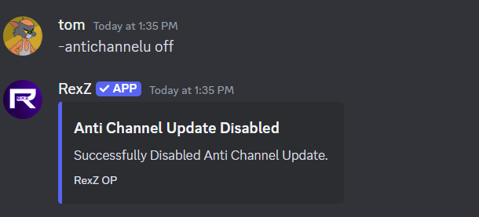--

---

## Anti community

### What is AntiCommunity?
anti community restrict users from enabling or disabling community in guild .

### Example
----
--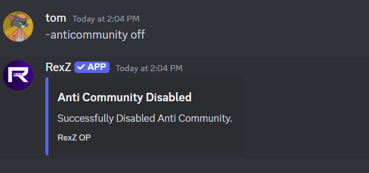--

---

## Anti emoji

### What is AntiEmoji?
Enabling anti emoji restricts user from adding or removing emoji in guild.

### Example
--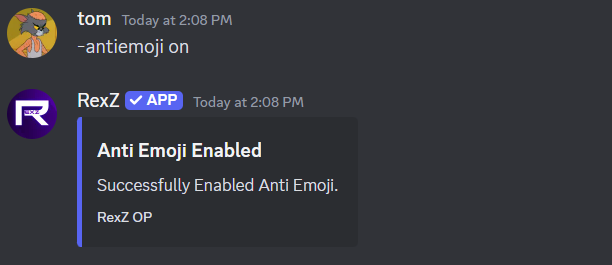--
--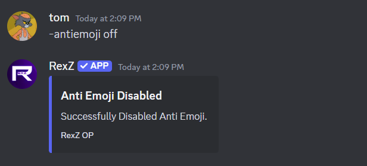--

---

## Anti emoji update

### What is AntiEmojiUpdate?
Enabling anti emoji update restricts user from updating emoji name in guild.

### Example
--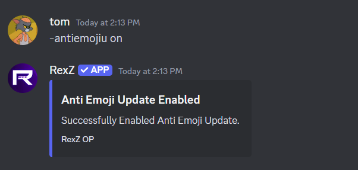--
--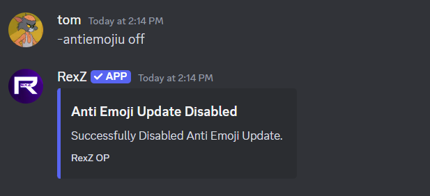--

---

## Anti everyone

### What is AntiEveryone?
Enablung anti everyone restricts user from using **@everyone** tag in guild.

### Example
--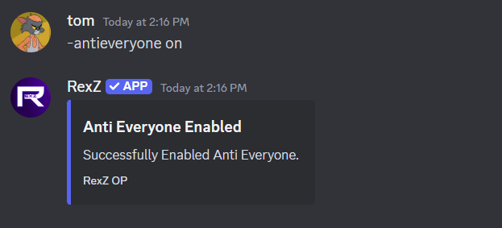--
--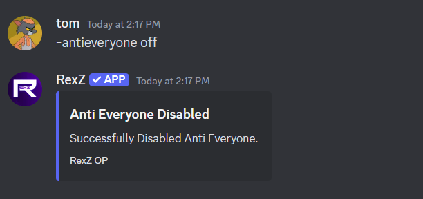--

---

## Anti guild update
### What is AntiGuildUpdate?
Enabling anti guild update restricts user from updating the guild.

### Example
--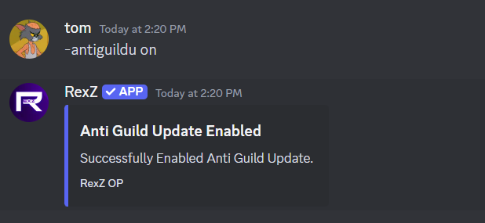--
--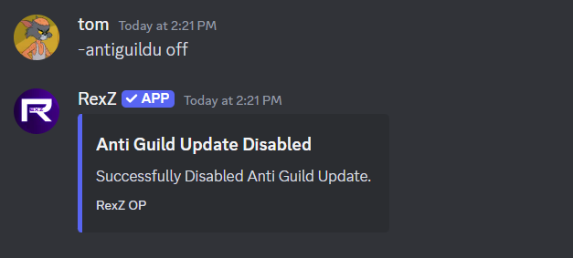--

---

## Anti kick

### What is AntiKick?
Sets limit on how many kicks bot will get triggered and take action on the user who used kick.
For example on [**-antikick 1**] bot will get triggered on 1 kick by anyone and bot will take action against that user.

### Example
----
----

---

## Anti member update

### What is AntiMemberUpdate?
Enabling anti member update restricts user from updating their/others role with dangerous permission in guild.

### Example
--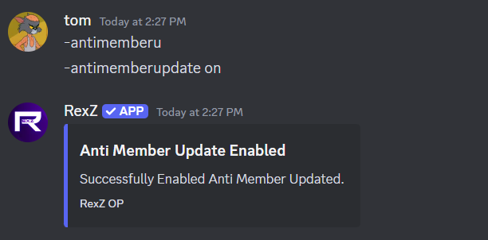--
--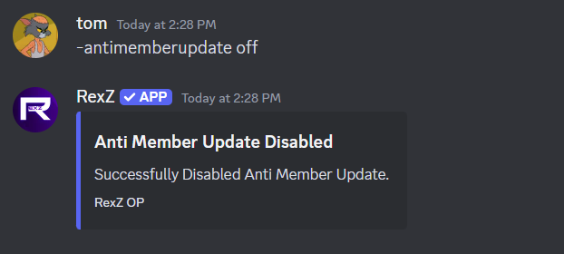--

---

## Anti public role

### What is AntiPublicRole?
Adding role in antipublic role list will restrict users from tagging that role in guild. for example [**@faimly**] role if added then users trying to tag that role will trigger the bot.

### Example
--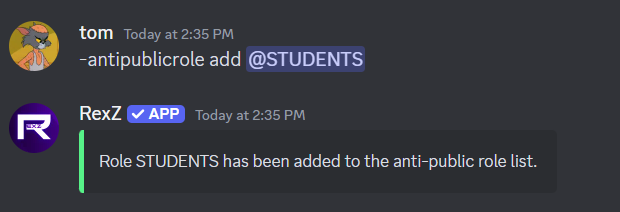--
----
--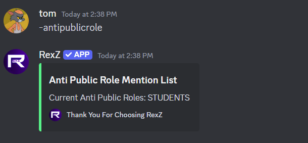--

---

## Anti role create

### What is AntiRoleCreate?
Sets limit on how many role creations will trigger the bot. For example [**-antirolec 2**] bot will get triggered when someone creates second role in guild and bot will take action against that user.

### Example
----
----

---

## Anti role delete

### What is AntiRoleDelete?
sets limit on how many role deletions will trigger the bot. For example [**-antiroled 2**] bot will get triggered when someone deletes second role in guild and bot will take action against that user.

### Example
--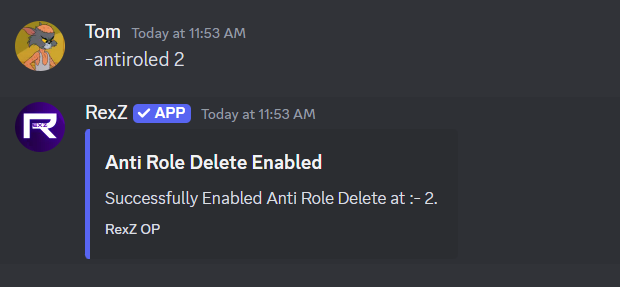--
--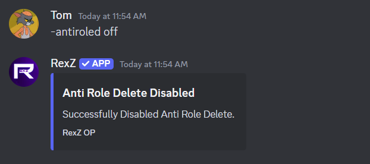--

---

## Anti role update

### What is AntiRoleUpdate?
Enabling this restrict users from updating role permissions in guild.

### Example
--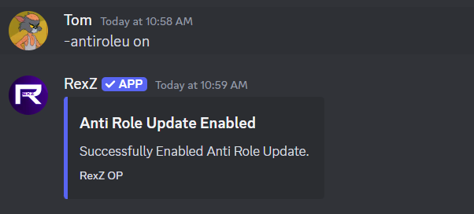--
--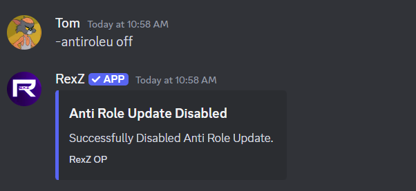--

---

## Anti self-bot

### What is AntiSelfBot?
Enabling this will restrict users from selfbotting in guild.

### Example
----
----

---

## Anti unverified bot

### What is AntiUnverifiedBot?
Enabling this will restrict users from adding unverified bots in guild.

### Example
--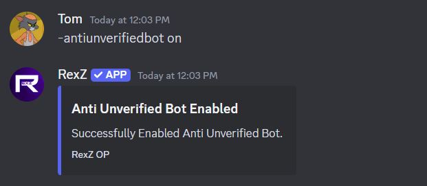--
--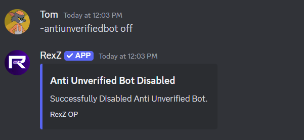--

---

## Anti webhook

### What is AntiWebhook?
Enabling this will restrict users from creating webhooks in guild.

### Example
----
----