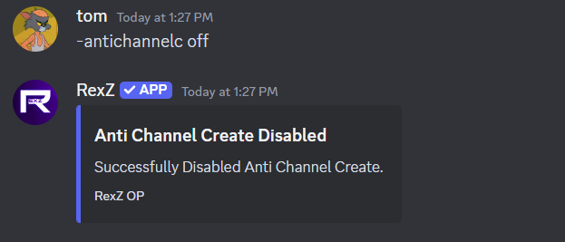

# Anti ban
### Description
Sets limit on how many bans bot will get triggered and take action on the user who used ban.
For example on [**-antiban 1**] bot will get triggered on 1 ban by anyone and bot will take action against that user.

{.compact}
Aliases   | Usage
---       | ---
antib  | -antiban <1/2/3/4/...>

### Usage
!!!primary Set guild's antiban limit
`-antiban <1/2/3/4/...>`
----
!!!

!!!primary Disable antiban
`-antiban off`
----
!!!

### Alias
!!!info
`-antib`
----
!!!

# Anti bot
### Description
Enabling antibot will restricts user from adding bots in guild.

### Usage
!!!primary
`-antibot <on/off>`
----
----
!!!

# Anti channel create
### Description
Set guild's channel create limit. For example [**-antichannelc 2**] bot will be triggered when the user tries to create second channel in guild

### Usage
!!!primary Set limit
`-antichannelc <1/2/3/4/...>`
----
!!!

!!!primary Disable
`-antichannelc off`
----
!!!

# Anti channel delete
### Description
Set guild's channel delete limit. For example [**-antichanneld 3**] bot will be triggered when the user tries to delete third channel in guild

### Usage
!!!primary Set limit
`-antichanneld <1/2/3/4/...>`
----
!!!

!!!primary Disable
`-antichanneld off`
----
!!!

# Anti channel update
### Description
Enabling anti channel update will restrict users to update any channel in guild.

### Usage
!!!primary
`-antichannelu <on/off>`
----
----
!!!

# Anti community
### Description
anti community restrict users from enabling or disabling community in guild .

### Usage
!!!primary
`-anticommunity <on/off>`
--
--
!!!

# Anti emoji
### Description
Enabling anti emoji restricts user from adding or removing emoji in guild.

### Usage
!!!primary
`-antiemoji <on/off>`
----
----
!!!

# Anti emoji update
### Description
Enabling anti emoji update restricts user from updating emoji name in guild.

### Usage
!!!primary
`-antiemojiu <on/off>`
----
----
!!!

# Anti everyone
### Description
Enablung anti everyone restricts user from using **@everyone** tag in guild.

### Usage
!!!primary
`-antieveryone <on/off>`
----
----
!!!

# Anti guild update
### Description
Enabling anti guild update restricts user from updating the guild.

### Usage
!!!primary
`-antiguildu <on/off>`
----
----
!!!

# Anti kick
### Description
Sets limit on how many kicks bot will get triggered and take action on the user who used kick.
For example on [**-antikick 1**] bot will get triggered on 1 kick by anyone and bot will take action against that user.

### Usage
!!!primary Set limit
`-antikick <1/2/3/4/...>`
----
!!!

!!!primary Disable
`-antikick off`
----
!!!

# Anti member update
### Description
Enabling anti member update restricts user from updating their/others role with dangerous permission in guild.

### Usage
!!!primary
`-antimemberupdate <on/off>`
----
----
!!!

# Anti public role
### Description
adding role in antipublic role list will restrict users from tagging that role in guild. for example [**@faimly**] role if added then users trying to tag that role will trigger the bot.

### Usage
!!!primary Add/Remove role to/from antipublic role list
`-antipublicrole <add/remove> @role/role ID`
----
----
!!!

!!!primary Show current antipublic role list
`-antipublicrole`
----
!!!

# Anti role create
### Description
sets limit on how many role creations will trigger the bot. For example [**-antirolec 2**] bot will get triggered when someone creates second role in guild and bot will take action against that user.

### Usage
!!!primary Set limit
`-antirolec <1/2/3/4/...>`
----
!!!

!!!primary Disable
`-antirolec off`
----
!!!

# Anti role delete
### Description
sets limit on how many role deletions will trigger the bot. For example [**-antiroled 2**] bot will get triggered when someone deletes second role in guild and bot will take action against that user.

### Usage
!!!primary Set limit
`-antiroled <1/2/3/4/...>`
----
!!!

!!!primary Disable
`-antiroled off`
----
!!!

# Anti role update
### Description
Enabling this restrict users from updating role permissions in guild.

### Usage
!!!primary
`-antiroleu <on/off>`
----
----
!!!

# Anti self bot
### Description
Enabling this will restrict users from selfbotting in guild.

### Usage
!!!primary
`-antiselfbot <on/off>`
----
----
!!!

# Anti unverified bot
### Description
Enabling this will restrict users from adding unverified bots in guild.

### Usage
!!!primary
`-antiunverifiedbot <on/off>`
----
----
!!!

# Anti webhook
### Description
Enabling this will restrict users from creating webhooks in guild.

### Usage
!!!primary
`-antiwebhook <on/off>`
----
----
!!!