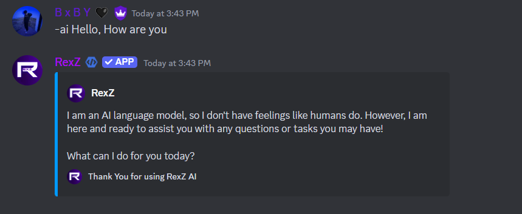

## Ask Command  
Ask AI chatbot a question.  

### Description  
Enables users to ask questions directly to the AI chatbot for quick responses.  

{.compact}  
Aliases  | Usage  
---      | ---  
ai       | Get an answer using RexZ AI  

### Example  
----  

---

## Gpt Command  
Ask OpenAI chatbot a question.  

### Description  
Allows users to interact with the AI-powered chatbot integrated into RexZ.  

{.compact}  
Aliases  | Usage  
---      | ---  
rexz     | Get an answer using RexZ AI  

### Example  
----