# Auto Moderation
Auto moderation in the RexZ Discord bot refers to automated tools and systems that help maintain order and enforce rules within a Discord server. It minimizes the need for constant manual intervention by staff or moderators. Here's how it works and features it may include:

## Auto Moderation Features in RexZ
- Automod Config
- Channel Whitelist
- Channel Unwhitelist
- Channel Whitelist List
- Auto Moderation whitelist
- Auto Moderation Unwhitelist
- Auto Moderation Whitelist List
- Anti Alt
- Anti Cap
- Anti Emoji Spam
- Anti Image
- Anti Line
- Anti Link
- Anti Mass Mention
- Anti NSFW
- Anti Spam
- Anti Word
- Anti Aalgo
- Discord AutoMod
- Special Channel

## Here’s a brief description of each AutoMod categories in RexZ:  

1. **Capital**: Detects and limits excessive usage of capital letters to prevent shouting or aggressive messages.  
2. **Word**: Filters specific words or phrases based on a customizable blacklist to maintain server standards.  
3. **DiscordPoll**: Blocks unauthorized discord polls from being shared in the server.  
4. **GhostPing**: Detects and flags users who delete pings after tagging others to avoid misuse.  
5. **Image**: Moderates inappropriate or excessive image sharing in the server.  
6. **Mass-Mention**: Detects and blocks excessive user or role mentions to prevent spam or harassment.  
7. **NSFW**: Blocks explicit or inappropriate content from being shared outside designated NSFW channels.  
8. **Spam**: Automatically detects and handles repetitive or excessive messages to prevent spam.  
9. **Zalgo**: Blocks the use of Zalgo (glitched/distorted) text to maintain message readability.  
10. **Alt**: Detects alternate accounts joining the server, which could be used for spamming or evading bans.  
11. **Line**: Limits the number of blank or excessive line breaks in a message to avoid spammy formatting.  
12. **Emojispam**: Restricts excessive emoji usage in messages to prevent visual clutter.  

---

## Automod Config

### What is Automod Config? 
The Auto Moderation configuration in RexZ allows server administrators to tailor the bot’s automated moderation behavior based on their needs.

### Description
Show the current automoderation settings for the guild

{.compact}
Aliases   | Usage
---       | ---
amconfig  | automodconfig

### Example
--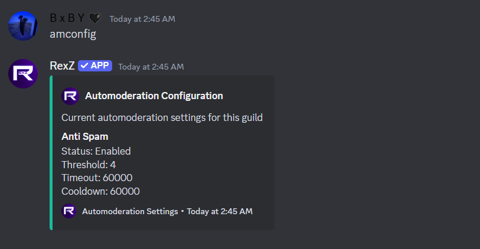--

---

## Channel Whitelist

### What is Channel Whitelist?
The channel whitelist feature in RexZ allows you to exempt specific channels from auto-moderation rules. This ensures that automated actions—like spam detection, word filtering, or link blocking—are not triggered in certain channels. It’s particularly useful for channels where moderation isn’t necessary (e.g., bot command channels or meme-sharing areas).

{.compact}
Aliases   | Usage
---       | ---
cwl       | channelwl #channel

### Example
--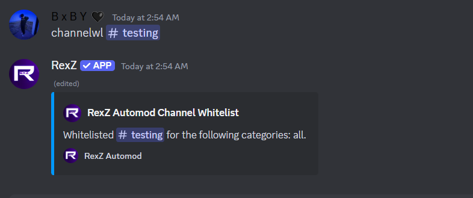--

---

## Channel Un-whitelist

### What is Channel Un-whitelist?
The channel unwhitelist feature in RexZ is used to remove a previously whitelisted channel from the AutoMod exclusion list. Once a channel is unwhitelisted, it becomes subject to all active auto-moderation rules, including spam detection, word filtering, link blocking, and other protections.

{.compact}
Aliases   | Usage
---       | ---
cuwl      | channeluwl #channel

### Example
----

---

## Channel Whitelist List

### What is Channel Whitelist List?
The channel whitelist list in RexZ displays all channels that have been excluded from AutoMod’s automated moderation rules. These channels won't be affected by features like spam detection, word filtering, or link blocking until removed from the whitelist.

{.compact}
Aliases   | Usage
---       | ---
cwllist   | channelwllist

### Example
--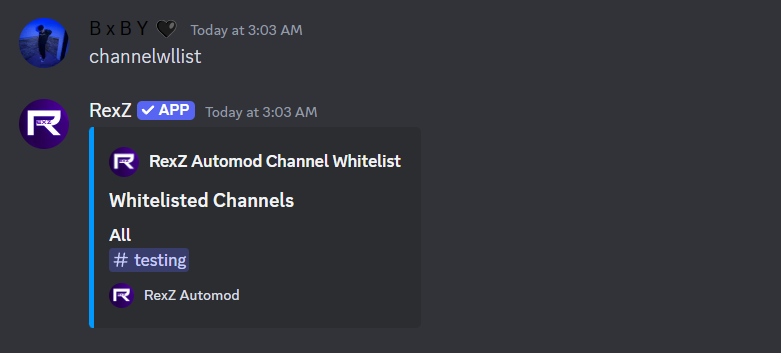--

---

## Automod Whitelist

### What is Automod Whitelist?
The AutoMod whitelist in RexZ allows administrators to exempt specific roles, or users from being affected by automated moderation rules. This feature is useful when you want to ensure that trusted individuals, bots can bypass moderation filters such as spam detection, word filtering, or link blocking.

{.compact}
Aliases   | Usage
---       | ---
amwl      | automoderationwhitelist @user / @role

### Example
--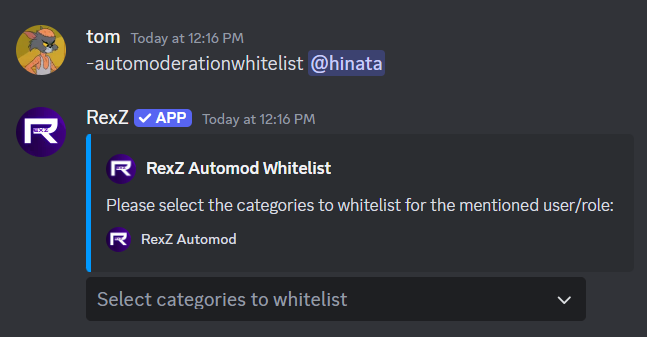--

---

## Auto Moderation Un-whitelist

### What is Automod Un-whitelist?
The AutoMod UnWhitelist feature in RexZ allows administrators to revoke the exemption status of certain roles, users, or bots from automated moderation rules. Once unwhitelisted, these entities will no longer bypass moderation filters, such as spam detection, Word filtering, link blocking, other moderation rules.

{.compact}
Aliases   | Usage
---       | ---
amuwl      | automoderationunwhitelist @user / @role

### Example
--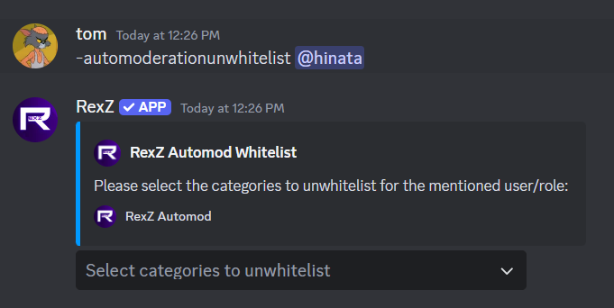--

---

## Auto Moderation Whitelist List

### What is Automod Whitelist list?
It is a comprehensive record/list of users and roles that have been whitelisted, allowing them to bypass automated moderation filters for one or more categories.

{.compact}
Aliases   | Usage
---       | ---
amwllist  | automoderationwhitelistlist

### Example
--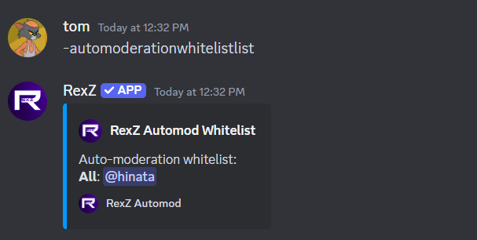--

---

## Anti Alti

### What is AntiAlt?
AntiAlt allows you to toggle the detection of alternate accounts on your server, configure the minimum account age requirement, and define actions to be taken when an alt is detected.

### Features and Functionality:
Toggle AntiAlt: Enable or disable the detection system for alternate accounts.
Account Age Limit: Set a minimum account age (e.g., 7 days, 30 days) required for users to join the server.
Customizable Actions: Choose what happens to detected alts, such as:
- **Kick**: Removing the account from the server.
- **Ban**: Permanently banning the account.
- **Timeout**: Mute the account from the server.

{.compact}
Aliases   | Usage
---       | ---
None      | antialt [on/off] [daysLimit] [action]

### Example
--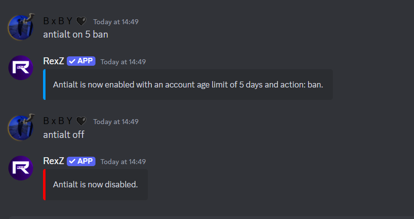--

---

##  Anti Cap

### What is Anti cap?
The AntiCap feature in RexZ helps manage excessive use of capital letters in messages to maintain a professional and non-aggressive chat environment.

### Key Features of AntiCap:
Toggle On/Off: Easily enable or disable the AntiCap feature for your server.

- **On**: Activates detection and moderation of messages with excessive capital letters.
- **Off**: Disables the AntiCap filter, allowing unrestricted use of capital letters.

{.compact}
Aliases   | Usage
---       | ---
None      | anticap [on/off] [limit] [timeout/no]

--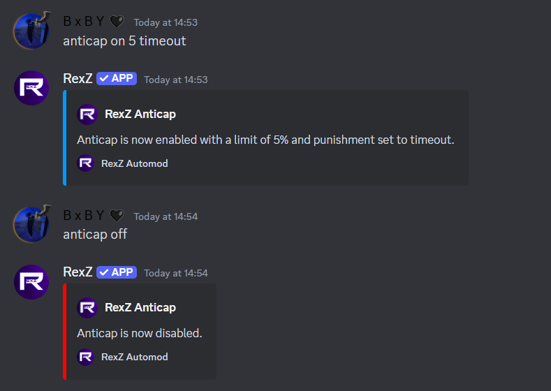--

---

##  Anti Cap

### What is Anti cap?
The AntiEmojiSpam feature in RexZ helps manage excessive use of emojis in messages to prevent visual clutter and maintain a clean chat environment.

### Key Features of AntiEmojiSpam:
Toggle On/Off:

- **On**: Enables detection and moderation of messages with an excessive number of emojis.
- **Off**: Disables the AntiEmojiSpam filter, allowing unrestricted emoji usage.
- **Timeout Punishment**: Automatically applies a timeout to users who violate the emoji spam rules, temporarily restricting them from participating in the chat.

{.compact}
Aliases   | Usage
---       | ---
None      | antiemoji [on/off] [limit] [timeout/no]

<!-- --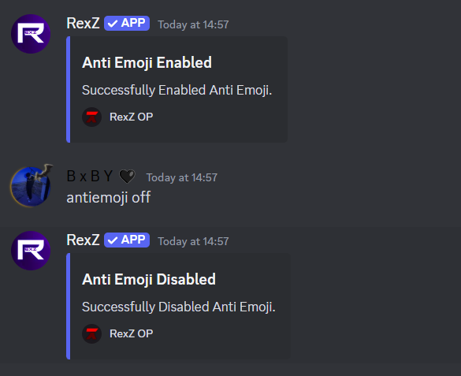-- -->

---

## Anti Image  

### What is Anti Image?  
The Anti Image feature in RexZ detects and moderates excessive or unauthorized image sharing in the server to maintain appropriate content sharing.  

### Key Features of Anti Image:  
- **Toggle On/Off**: Enable or disable the detection of image-sharing violations.  
- **Set Limits**: Configure the maximum number of images allowed per message.  
- **Timeout Option**: Choose whether to apply a timeout or only log violations.  

{.compact}  
Aliases   | Usage  
---       | ---  
None      | antiimage [on/off] [limit] [duration] [timeout/no]  

---

## Anti Line  

### What is Anti Line?  
The Anti Line feature in RexZ restricts excessive line breaks in messages to avoid spammy formatting in chats.  

### Key Features of Anti Line:  
- **Toggle On/Off**: Enable or disable the detection of excessive line breaks.  
- **Set Line Limit**: Define the maximum number of allowed line breaks in messages.  
- **Timeout Option**: Choose whether to apply a timeout for violations.  

{.compact}  
Aliases   | Usage  
---       | ---  
None      | antiline [on/off] [number_of_lines] [timeout/no]  

---

## Anti Link  

### What is Anti Link?  
The Anti Link feature in RexZ blocks unauthorized or spammy links to prevent phishing attempts or unwanted promotions.  

### Key Features of Anti Link:  
- **Toggle On/Off**: Enable or disable the detection of unauthorized links.  
- **Timeout Option**: Optionally apply a timeout when violations occur.  

{.compact}  
Aliases   | Usage  
---       | ---  
None      | antilink [on/off] [timeoutDuration/no]  

!!!primary Antilink auto 
`-antilink <on/off>`
--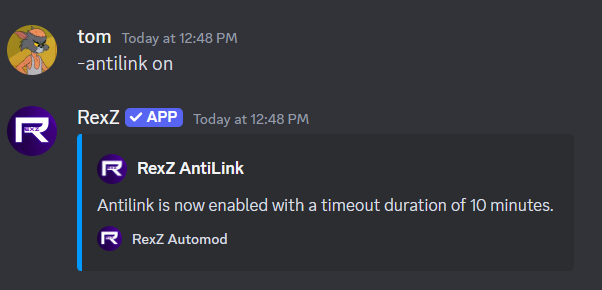--
!!!

!!!primary Antilink with Timeout
`-antilink on timeoutDuration`
--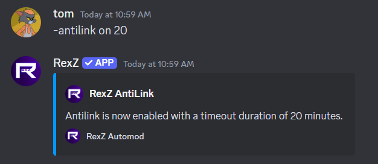--
!!!

!!!primary Antilink without Timeout
`-antilink on no`
--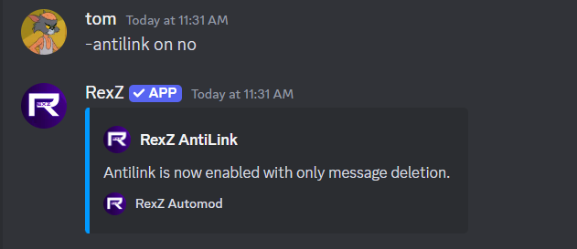--
!!!

!!!primary Antilink off
`-antilink off`
--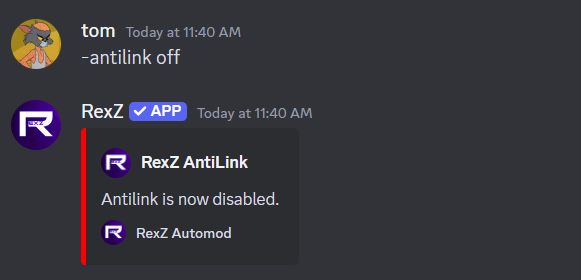--
!!!

---

## Anti Mass Mention  

### What is Anti Mass Mention?  
The Anti Mass Mention feature in RexZ prevents spamming by limiting excessive mentions of users or roles in a single message.  

### Key Features of Anti Mass Mention:  
- **Toggle On/Off**: Enable or disable the detection of mass mentions.  
- **Mention Limit**: Set the maximum number of mentions allowed per message.  
- **Timeout Option**: Apply a timeout for users exceeding the mention limit.  

{.compact}  
Aliases   | Usage  
---       | ---  
None      | antimassmention [on/off] [mentionLimit] [timeoutDuration/no]  

---

## Anti NSFW  

### What is Anti NSFW?  
The Anti NSFW feature in RexZ ensures that explicit or inappropriate content is blocked from being shared in non-NSFW channels.  

### Key Features of Anti NSFW:  
- **Toggle On/Off**: Enable or disable the detection of NSFW content.  
- **Timeout Option**: Optionally apply a timeout for users sharing NSFW content.  

{.compact}  
Aliases   | Usage  
---       | ---  
None      | antinsfw [on/off] [timeoutDuration/no]  

---

## Anti Spam  

### What is Anti Spam?  
The Anti Spam feature in RexZ detects and manages repetitive or excessive messages to prevent spamming.  

### Key Features of Anti Spam:  
- **Toggle On/Off**: Enable or disable the detection of spam.  
- **Spam Threshold**: Define the number of messages allowed before a user is flagged.  
- **Cooldown Duration**: Specify the time period to reset spam counts.  
- **Timeout Option**: Optionally apply a timeout for spamming users.  

{.compact}  
Aliases   | Usage  
---       | ---  
None      | antispam [on/off] [timeoutDuration] [spamThreshold] [cooldownDuration]

---

## Anti Word  

### What is Anti Word?  
The Anti Word feature in RexZ filters messages containing blacklisted words or phrases to maintain server standards and prevent inappropriate or unwanted language in your server.  

### Key Features of Anti Word:  
- **Toggle On/Off**: Enable or disable the detection of blacklisted words in messages.  
- **Timeout Option**: Optionally apply a timeout for users violating the word filter.  
- **Add Words**: Add specific words or phrases to the blacklist for automatic moderation.  
- **Remove Words**: Remove words from the blacklist to allow their use.  
- **List Blacklisted Words**: View all currently blacklisted words for review or updates.  

{.compact}  
Aliases   | Usage  
---       | ---  
None      | antiword [on/off] [timeout/no]
None      | antiword add [word1,word2,...]
None      | antiword remove [word1,word2,...]
None      | antiword list

---

## Anti Zalgo  

### What is Anti Zalgo?  
The Anti Zalgo feature in RexZ blocks the use of distorted or glitched text (Zalgo) to maintain message readability.  

### Key Features of Anti Zalgo:  
- **Toggle On/Off**: Enable or disable the detection of Zalgo text.  
- **Timeout Option**: Choose whether to apply a timeout for violations.  

{.compact}  
Aliases   | Usage  
---       | ---  
None      | antizalgo [on/off] [timeout/no]  

---

## Discord AutoMod  

### What is Discord AutoMod?  
The Discord AutoMod integration in RexZ utilizes native moderation rules alongside RexZ’s powerful filters to enhance server security and compliance.  

### Key Features of Discord AutoMod:  
- **Toggle On/Off**: Enable or disable the use of Discord’s AutoMod within RexZ.  
- **Add Rules**: Create custom rules using specific trigger types and actions.  
- **List Rules**: View all active AutoMod rules.  

{.compact}  
Aliases   | Usage  
---       | ---  
None      | discordautomod [on/off]  
None      | discordautomod add [ruleName] [triggerType] [trigger]  
None      | discordautomod list  

---

## Special Channel  

### What is Special Channel?  
The Special Channel feature in RexZ allows administrators to assign specific channels where custom rules and exceptions apply.  

### Key Features of Special Channel:  
- **Add Channel**: Assign a special status to a channel.  
- **Remove Channel**: Revert the channel to default moderation rules.  

{.compact}  
Aliases   | Usage  
---       | ---  
None      | specialchannel #channel  
None      | specialchannel off #channel  