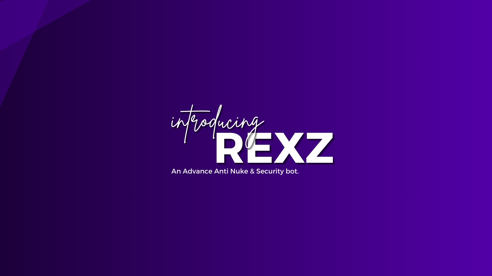

## What Is RexZ?

RexZ is a Discord bot with Advanced Anti Nuke system. It has a lot of features and commands. RexZ is built to protect your server from nukers. RexZ is a Discord bot written in Javascript using discord.js library. It was created & developed by Sam & Venom.

----

Introducing RexZ, your ultimate security bot for Discord servers! RexZ is expertly crafted to shield your community from various disruptive threats, including nuking attempts, spam, and raids.

With its advanced algorithms and powerful features, RexZ acts as a vigilant guardian, constantly monitoring server activity and quickly addressing any suspicious behavior. Designed with cutting-edge technology and extensive development, RexZ ensures top-notch protection without sacrificing performance or user experience.

Whether you're managing a small group or a large, bustling server, RexZ adapts seamlessly to provide the security you need. Trusted by numerous Discord communities worldwide, RexZ offers the peace of mind that comes with knowing your server is well-protected.

Equip your server with RexZ today and rest easy knowing your community is safe and secure.

## What can RexZ do? 

=== 1. Real-Time Monitoring:
RexZ keeps a vigilant eye on your server, monitoring all activities to detect any unusual or suspicious behavior.
 
=== 2. Threat Detection and Response:
RexZ can identify and respond to a wide range of threats, including nuking attempts, spam, and raids, ensuring immediate protection for your server.

=== 3. Anti-Nuke Capabilities:
RexZ's advanced algorithms are designed to detect and prevent nuking attacks, safeguarding your server's channels, roles, and settings from mass deletions or alterations.

=== 4. Spam Filtering:
RexZ automatically identifies and blocks spam messages, keeping your server free from disruptive and unwanted content.

=== 5. Raid Protection:
RexZ can recognize and mitigate raid attempts by managing large influxes of malicious users, ensuring your server remains secure and orderly.

=== 6. Automated Moderation:
RexZ can handle common moderation tasks such as managing inappropriate language, links, and behavior, reducing the workload on human moderators.

=== 7. User Verification:
RexZ implements robust user verification processes to ensure new members are legitimate and not bots or malicious users.

=== 8. Role and Permission Management:
RexZ automatically manages roles and permissions, preventing unauthorized changes that could compromise your server's security.

=== 9. Detailed Logging:
RexZ maintains comprehensive logs of all actions and events, providing transparency and a clear record of any security incidents.

=== 10. Customizable Security Settings:
RexZ allows you to tailor its security features to fit your server's specific needs, offering customizable settings and flexible configurations.

=== 11. Instant Alerts:
RexZ sends instant alerts for any suspicious activity, allowing you to take swift action if necessary.

=== 12. Seamless Integration:
RexZ integrates smoothly with your existing server setup, providing top-tier security without disrupting your community's activities.

=== 13. Regular Updates:
RexZ receives regular updates to ensure it remains equipped with the latest security features and improvements.

=== 14. Multi-Server Support:
RexZ can administer multiple servers simultaneously, providing consistent protection across all your communities with a single tool.

=== 15. User-Friendly Interface:
RexZ offers an intuitive and user-friendly interface, making it easy for both novice and experienced admins to manage server security.

=== 16. Support and Documentation:
RexZ provides comprehensive support and documentation to help you utilize all its features effectively and keep your server secure.
===
Equip your Discord server with RexZ to benefit from its extensive capabilities, ensuring a safe and enjoyable environment for all your members.