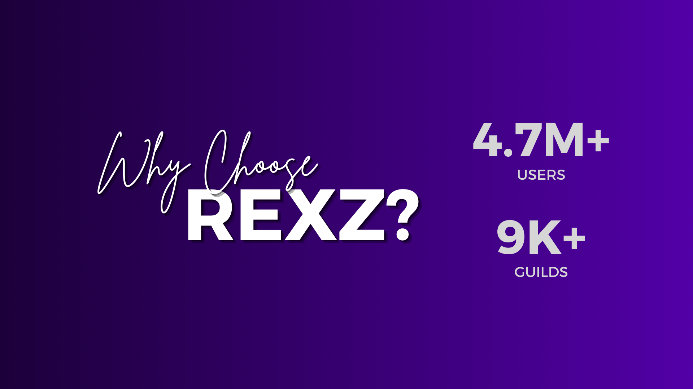

## Why RexZ?

RexZ is designed to provide top-level security, moderation, and automation for your Discord server. With powerful Anti-Nuke protection, advanced moderation tools, and real-time security alerts, RexZ helps keep your community safe from threats. Whether you're managing a small group or a large server, RexZ ensures smooth operation with customizable settings, an AI chatbot, and 24/7 reliability. Choose RexZ for a secure and well-managed Discord experience!

----

## Anti-Nuke Capabilities
RexZ's anti-nuke capabilities are one of its standout features, designed to protect your server from devastating nuking attempts. Nuking involves mass deleting channels, roles, and messages, which can cause significant disruption and chaos. RexZ’s sophisticated algorithms detect these malicious activities in real-time, immediately halting the attack and preserving your server's integrity. By automatically identifying and blocking these threats, RexZ ensures that your server's structure and content remain intact, giving you peace of mind and saving you from potential restoration efforts.

## Robust Security
Security is at the heart of RexZ’s design. With continuous real-time monitoring, RexZ keeps a vigilant eye on all server activities, ready to respond to any suspicious behavior. Its advanced threat detection system can identify a variety of potential threats, from malicious bots to harmful user actions, and respond swiftly to neutralize them. RexZ's comprehensive security measures ensure that your server remains a safe environment for all members, protecting against unauthorized access and potential breaches.

## Automated Moderation
RexZ significantly reduces the workload on human moderators by automating many of the routine moderation tasks. It can handle inappropriate language, spam, and disruptive behavior efficiently, maintaining the decorum of your server without constant manual oversight. RexZ’s automated moderation system ensures that community guidelines are enforced consistently and fairly, allowing moderators to focus on more complex issues while RexZ manages the day-to-day moderation tasks seamlessly.

## Raid Defense
Raid attacks, where a large number of malicious users join a server simultaneously to cause havoc, are a serious threat to any community. RexZ's raid defense capabilities are designed to detect and mitigate these attacks swiftly. By monitoring for unusual spikes in user activity and employing sophisticated defense mechanisms, RexZ can prevent raiders from overwhelming your server. This proactive approach not only stops raids in their tracks but also deters future attempts, ensuring your server remains a secure and welcoming place for genuine members.

## Role and Permission Management
Managing roles and permissions is crucial for maintaining order and security within a server. RexZ automates this process, ensuring that roles and permissions are assigned and modified correctly. It prevents unauthorized changes that could compromise your server’s security, such as granting admin privileges to untrusted users. With RexZ, you can be confident that your server’s hierarchy and permissions are well-maintained, protecting against internal threats and ensuring a smooth operational flow.

## Alerts System
RexZ’s alert system is designed to keep server admins informed of any critical events in real-time. Whenever suspicious activity is detected, or a potential threat is identified, RexZ sends immediate alerts, allowing admins to take swift action. This feature ensures that you are always aware of what’s happening in your server, providing the opportunity to respond proactively rather than reactively. The alert system is a crucial component of RexZ’s comprehensive security approach, helping you maintain control and oversight over your server at all times.

RexZ offers a robust suite of features that work together to provide unparalleled protection and management for your Discord server. From preventing devastating nuking attempts to managing roles and permissions with precision, RexZ is your ultimate partner in maintaining a secure, well-moderated, and smoothly functioning community.