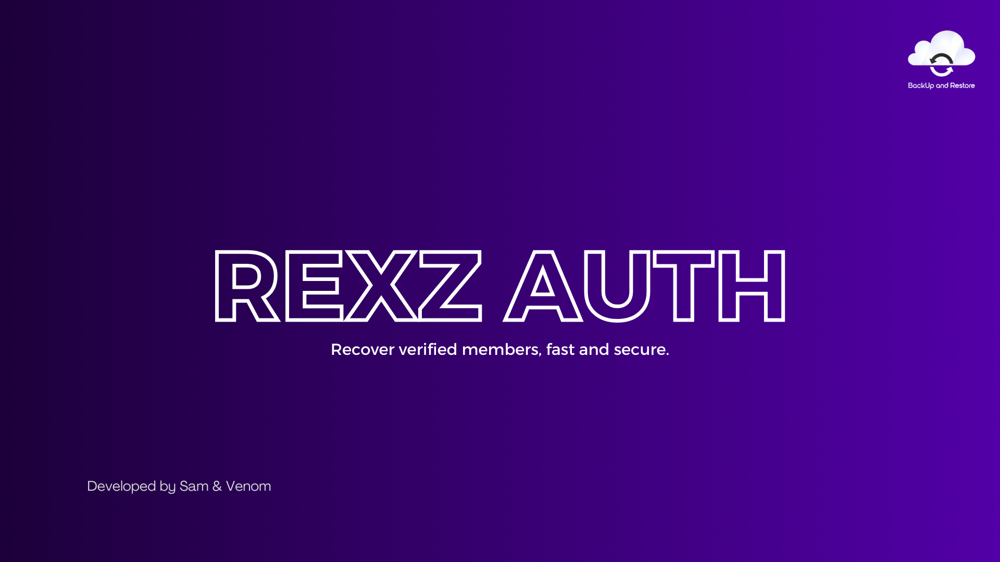

# RexZ Auth Bot

**RexZ Auth** helps you back up your verified members. If your server is compromised, RexZ will recover all users who previously verified using the bot. This ensures a swift and secure restoration of trusted members after a server is nuked or pruned, allowing you to maintain a stable and safe environment.

----

## Introduction

RexZ Auth Bot is a powerful tool that assists server administrators in recovering verified users after a server has been compromised. It does not alter roles, permissions, or server settings but focuses solely on reintroducing previously verified members back into the server. This helps admins quickly restore the community to its original state and ensures that only legitimate users have access.

## Features

- **Verified User Backup**: Automatically stores a list of verified members for easy recovery after a server is nuked or pruned.
- **Quick Recovery**: Recovers all verified members back to the server after a security breach, without affecting roles or permissions.
- **Action Logs**: Tracks and logs all recovery actions for transparency.
- **Real-time Notifications**: Alerts server admins about the recovery process, keeping them informed about progress and actions taken.

## Commands

- `/help` - View the help command menu.
- `/ping` - Check the bot's latency and response time.
- `/setup` - Set up the bot for your server.
- `/recover` - Recover all verified members after a nuke or prune.

With RexZ Auth Bot, you can ensure that your community remains protected and verified users are safely restored after any server security breach.

!!!secondary Useful links you might need !!
[:icon-link-external: Invite RexZ Auth Bot](https://discord.com/oauth2/authorize?client_id=1318705371342180512)
!!!