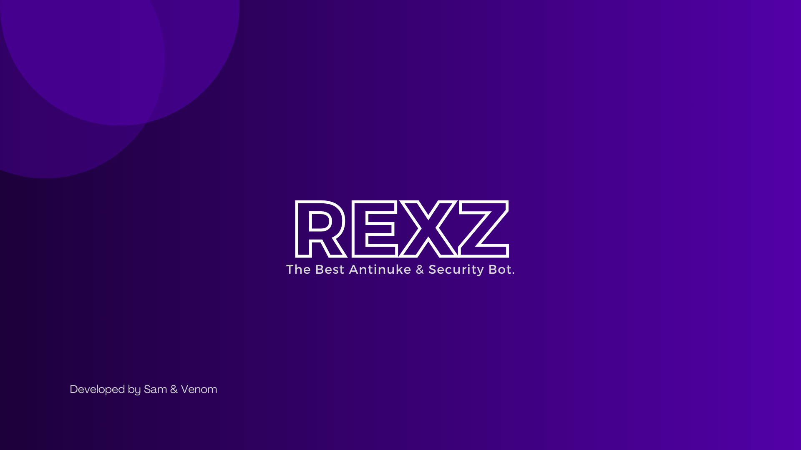

# The Best AntiNuke & Security Bot

Welcome to RexZ, your advanced security and anti-nuke bot for Discord servers! RexZ is your ultimate line of defense against malicious attacks aimed at disrupting your server's peace and integrity.

RexZ is meticulously designed to safeguard your community from a variety of threats, including nuking attempts, spam attacks, raiding, and more. With its sophisticated algorithms and robust features, RexZ acts as a vigilant guardian, constantly monitoring your server's activity and swiftly responding to any suspicious behavior.

----

Powered by cutting-edge technology and years of development, RexZ offers unparalleled protection without compromising on performance or user experience. Whether you're managing a small community or a bustling server with thousands of members, RexZ scales effortlessly to meet your security needs.

Join countless Discord servers worldwide that trust RexZ to keep their communities safe and secure. Don't leave your server vulnerable to threats – empower it with RexZ today and enjoy peace of mind knowing that your community is in good hands.

## Navigation

We have pages and pages of informations about the various functions, commands and settings, all organized into different categories.(Given Below):
- The [!button size="xs" text="Introduction"](./Introduction/WhatIsRexz.md) category informs you about what RexZ is, including a full description of its features.
- The [!button size="xs" text="Setup"](./setup.md) page displays easy and fast setup method.
- The [!button size="xs" text="Commands"](./Commands/ArtificialIntelligence/) category covers all RexZ's commands.
- The [!button size="xs" text="Privacy & Policy"](./privacypolicy.md) page shows up our privacy policy in detailed view.

!!!secondary Useful links you might need !!
[:icon-link-external: Invite Bot](https://discord.com/api/oauth2/authorize?client_id=856741116912861276&permissions=8&scope=bot%20applications.commands)  
[:icon-link-external: Discord Support Server](https://discord.gg/YcnBaSG8AF)
!!!