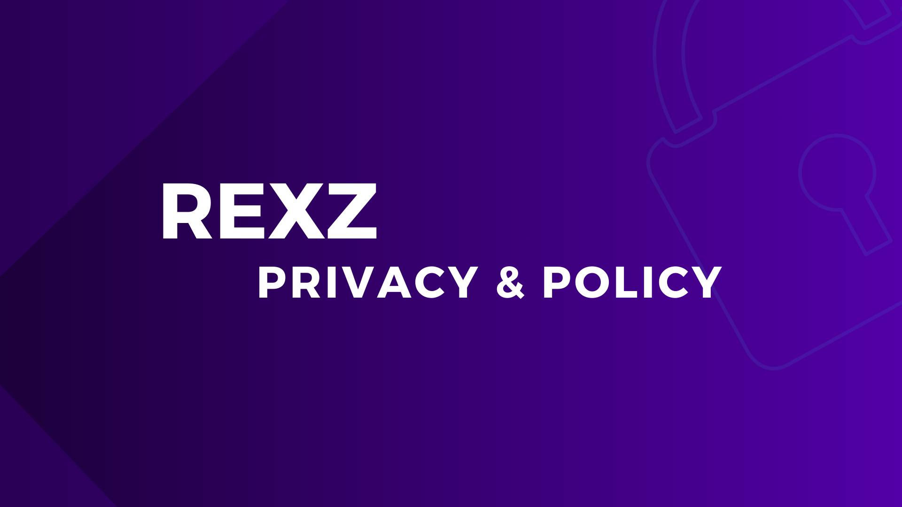

## Privacy & Policy

----

By using our Site/Bot, you agree that you have read and agreed to this policy.

We may update this Privacy Policy from time to time. Changes in our Privacy Policy will be effective immediately. If you are a regular visitor, we recommend that you check this Privacy Policy on a regular basis. By using the website and/or bot, you consent to the collection, use and transfer of your information in accordance with this Privacy Policy. If you do not agree to this Privacy Policy, please do not use our website or our bot.

## What does RexZ store?

Server IDs for servers data (anti nuke, punishments, etc)

User IDs for user data (whitelisting, mod, owner)

## Who can access the data?

Bot Developer(s)

Server's Real, Second Owner can access the value they setup

Server Admin/Mod may access logs

## How can I get rid of the data stored?

Ask the server owner to remove you from whitelisted/mod/admin/2nd owner.

## Why do we store the data?

We need servers ids to store server data, user ids under them for whitelisting, mod, admin & 2nd owner

!!!info This Privacy Policy doesn't answer my question. What should I do?
Go to ⁠[Support Server](https://discord.gg/gDA4tthJxG) and ask your query their with patience